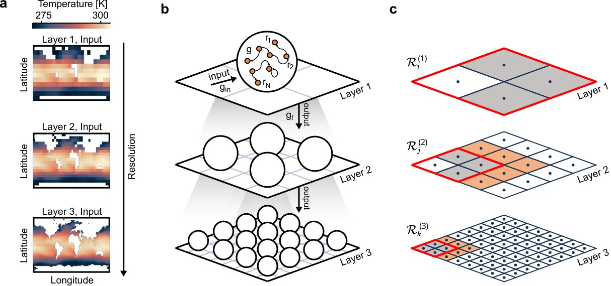

# Cross-scale reservoir computing for large spatio-temporal forecasting and modeling

[](https://github.com/nicoalbo0/cross-scale-reservoir-computing/actions/workflows/CI.yml?query=branch%3Amain)
[](https://julialang.org/)
[](LICENSE)
[](https://doi.org/10.1016/j.neucom.2026.133849)
[](https://doi.org/10.5281/zenodo.18846959)



> **Cross-scale reservoir computing (CS-RC)** is a hierarchical architecture
> for forecasting high-resolution spatio-temporal systems. It passes non-local,
> coarse-grained dynamics from lower-resolution reservoir layers to finer ones,
> combining long-range context with local spatial detail.

Alboré, N., Di Antonio, G., Coccetti, F., & Gabrielli, A. (2026).
*Cross-scale reservoir computing for large spatio-temporal forecasting and
modeling.* Neurocomputing, 692, 133849.
[doi:10.1016/j.neucom.2026.133849](https://doi.org/10.1016/j.neucom.2026.133849).
See [`CITATION.cff`](CITATION.cff) for machine-readable paper citation metadata.

## Abstract

We propose a new reservoir computing method for forecasting high-resolution
spatiotemporal datasets. While many machine learning methods suffer from limited
interpretability and computational intractability in high-dimensional settings,
reservoir computing offers inherent advantages through its lightweight linear
training. Our hierarchical architecture combines multi-resolution inputs from
coarser to finer layers, enabling the capture of both local dynamics and
long-range dependencies. Applied to Sea Surface Temperature data, it outperforms
standard parallel reservoir models in long-term forecasting, demonstrating the
effectiveness of cross-layer coupling in improving predictive accuracy. We find
that the optimal network dynamics in each layer become increasingly linear,
revealing the slow modes propagated to subsequent layers. Finally, we evaluate
the method on a chaotic system, where a strongly coupled two-layer configuration
achieves accurate forecasts and offers favorable accuracy-cost tradeoffs
compared with established reservoir baselines.

---

## Clone and install

1. **Clone the repository**

   ```bash
   git clone https://github.com/nicoalbo0/CrossScaleRC.git
   cd CrossScaleRC
   ```
2. **Install Julia**Use [Julia 1.11+](https://julialang.org/downloads/).
3. **Activate the project and install dependencies**

   ```bash
   julia --project=.
   ```

   In the Julia REPL:

   ```julia
   using Pkg
   Pkg.instantiate()
   ```

   Or from the shell:

   ```bash
   julia --project=. -e 'using Pkg; Pkg.instantiate()'
   ```
4. **Run the package**

   ```julia
   using CrossScaleRC
   ```

   Or run a main script from the project root, e.g.:

   ```bash
   julia --project=. main_single_layer.jl
   ```

---

## Data

### Kuramoto–Sivashinsky (KS) data

The KS data used in the single- and multi-layer RC experiments can be generated with the MATLAB code from the **parallelized-reservoir-computing** repository:

- **Repository:** [jdppthk/parallelized-reservoir-computing](https://github.com/jdppthk/parallelized-reservoir-computing)
- **Script:** [KSBasicSingleReservoir/generate_data.m](https://github.com/jdppthk/parallelized-reservoir-computing/blob/b18dd8c8cb2068d77c9b0d9ec7461e5e06059ba3/KSBasicSingleReservoir/generate_data.m)

That script integrates the Kuramoto–Sivashinsky equation (with an optional multiplicative asymmetry term) and saves the solution. Export or convert the output to CSV and place the file under `data/kuramoto/` with the naming convention expected by `load_data` (e.g. `Q128_L44_mu0.01_ks_data.csv` for `Q=128`, `L=44`, `μ=0.01`). See `src/data/loading.jl` and the main scripts for the exact path and naming.

### Sea surface temperature (SST) data

To use **sea surface temperature** data, follow the scripts in the `scripts/` folder in this order:

1. **`scripts/download_sst_data.py`** (Python)Downloads daily SST from the Copernicus CDS (satellite sea surface temperature ensemble product) for the chosen years/months/days. Requires a CDS API key and `cdsapi`. Writes files under `data/sst/YYYY/MM/DD/`.
2. **`scripts/main_regrid.jl`** (Julia)Reads the raw daily files and regrids them to the desired resolution (e.g. 2° or 18°), applying scale and offset. Saves regridded fields as JLD2 files (e.g. `sst_regridded_<resolution>.jld2` per day).
3. **`scripts/main_produce_sst_data.jl`** (Julia)
   Concatenates all daily regridded JLD2 files into a single 3D array (lon × lat × time) and saves it as `data/sst/sst_final_<resolution>.jld2`. The package’s `load_data(resolutions_vec; ...)` then uses these `sst_final_*` (and builds `sst_clean_*` if needed).

Run the Python script from the project root so that `data/sst/` is created in the right place; run the Julia scripts with `Pkg.activate(".")` or from the repo root with `--project=.` so that `CrossScaleRC` and paths resolve correctly.

---

## Main scripts

These are the main entry points for running experiments.

| File                           | Description                                                                                                                                                                                                                                                                    |
| ------------------------------ | ------------------------------------------------------------------------------------------------------------------------------------------------------------------------------------------------------------------------------------------------------------------------------ |
| **main_single_layer.jl** | Single-layer reservoir computing on 1D KS data. Loads KS data, optionally regrids, builds spatial blocks, trains one ESN per block with local + neighbor inputs, and runs closed-loop prediction. Good starting point for the block-wise RC pipeline.                          |
| **main_multi_layer.jl**  | Two-layer (coarse → fine) RC on 1D KS data. Coarse layer is run first; its predictions are upscaled and fed as “layer” input to the fine layer. Uses`run_multi_layer` and 1D blocks from `make_blocks(..., overlap_mode=...)`.                                          |
| **main_deep_rc.jl**      | Deep Echo State Network (DeepESN) on KS data. Multi-layer reservoir with quadratic readout features. Trains with`DeepESN_train!` and runs closed-loop test with `DeepESN_test_closed_loop`. No spatial blocking; single global deep reservoir.                             |
| **main_ngrc.jl**         | Next-Generation RC (NG-RC) on KS data. Uses polynomial features on a delay embedding and ridge regression for the one-step map, then closed-loop prediction. No reservoir; lightweight and fast.                                                                               |
| **main_sst.jl**          | Two-layer RC on**sea surface temperature** data. Loads multi-resolution SST via `load_data([18.0, 6.0]; ...)`, builds 2D blocks with `make_blocks(data, grids, mixing)`, flattens to matrices, and runs `run_multi_layer` (coarse + fine) with 2D block structure. |

All main scripts set up data, hyperparameters, and (where applicable) blocks, then call the appropriate high-level API (`run_single_layer`, `run_multi_layer`, `DeepESN_*`, `nextgen_closedloop`). Tuning and grid-search are handled by the `run_tuning_*.jl` scripts.
